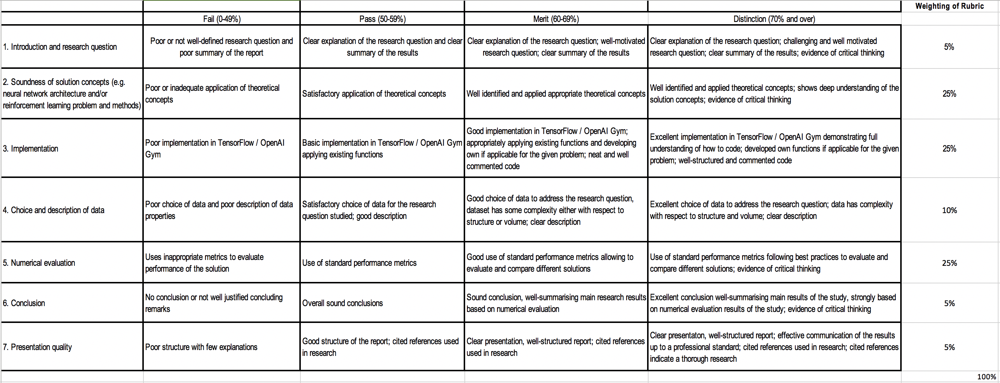

# ST449 Course Project

 

This is the repository for the course project – please keep anything project related in this repository.

 

**Project Deadline: 30th April 2020, 5 pm London time.**

 

Please add the following information:

 ## Project title:

 

Smart Indexing using Autoencoders

 

## Summary:

Building portfolios that replicate market indices is of central importance in the financial world. This project will explore how successfully Deep Learning can replicate these indices and potentially outperform them while taking on less risk. 

Topics to be explored:
1. Recreate Smart Indexing from [Deep Learning in Finance](https://arxiv.org/pdf/1602.06561.pdf) on the S&P500. 
2. Explore the use of a variety of autoencoders to create replication portfolios
3. Use autoencoders as an input to an LSTM network and see if it can build portfolios with higher returns

The dataset will primarily consist of adjusted closing stock values and geometric moving average returns of shares on the S&P 500 index.

This project relates to weeks 1-5 of the course. In particular, it focuses on autoencoders which are neural networks where the output is the input. Week 4 (convolutional neural networks) are also explored.

## References 

[Deep Learning in Finance](https://arxiv.org/pdf/1602.06561.pdf)

[Deep Learning for Finance: Deep Portfolios](https://www.ssrn.com/abstract=2838013)

[A deep learning framework for financial time series using stacked autoencoders and long- short term memory](https://www.researchgate.net/publication/318991900_A_deep_learning_framework_for_financial_time_series_using_stacked_autoencoders_and_long-short_term_memory)

[Autoencoder Asset Pricing Models](https://papers.ssrn.com/sol3/papers.cfm?abstract_id=3335536)

## Notes

[MV - 8 April 2020] Approved. Sounds interesting. You may want to experiment with using different autoencoder models. I assume you will develop your own implementation in TensorFlow 2.x.

---

## Marking criteria

 

## Candidate topics

[Project.md](https://github.com/lse-st446/lectures2020/blob/master/Projects.md)

 
